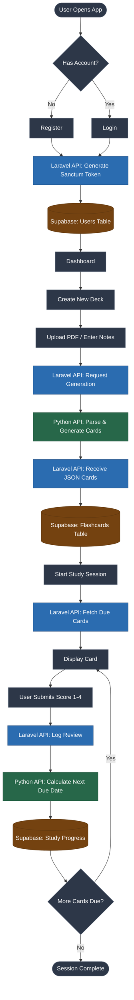

# SummQ

SummQ is a spaced-repetition study platform that automates flashcard creation using artificial intelligence. This organization contains the source code for the mobile client, the core backend API, and the data science microservice.

## Problem Statement

Manual flashcard creation is highly inefficient and disrupts the learning workflow. Existing solutions either require manual data entry, which consumes hours of study time, or they lack sophisticated spaced-repetition algorithms. Students need a system that minimizes preparation time and maximizes retention through optimized, data-driven review schedules.

## Project Idea

SummQ eliminates manual deck creation by parsing user-uploaded study materials (PDFs and text notes) and generating high-quality question-and-answer pairs via an AI pipeline. The application then schedules these flashcards for review using a custom spaced-repetition algorithm that adapts to the user's historical recall accuracy, ensuring optimal memory retention.

## Target Audience

* **University Students:** Specifically those in high-volume memorization fields like medicine, law, and engineering.
* **Language Learners:** Users building vocabulary through aggressive repetition.
* **Certification Candidates:** Professionals studying for standardized technical or medical board exams.

## Technologies Used

The SummQ ecosystem is split into three core repositories, utilizing a microservices architecture:

* **Frontend Client:** Flutter, Dart
* **Core API:** Laravel 11, PHP, Sanctum (Auth)
* **Data Science / AI Service:** Python (Data processing, LLM integration, Spaced Repetition calculation)
* **Database & Infrastructure:** PostgreSQL (Supabase), Vercel (Serverless deployments)

## Application User Flow

The following diagram outlines the standard user journey from authentication to active studying.

